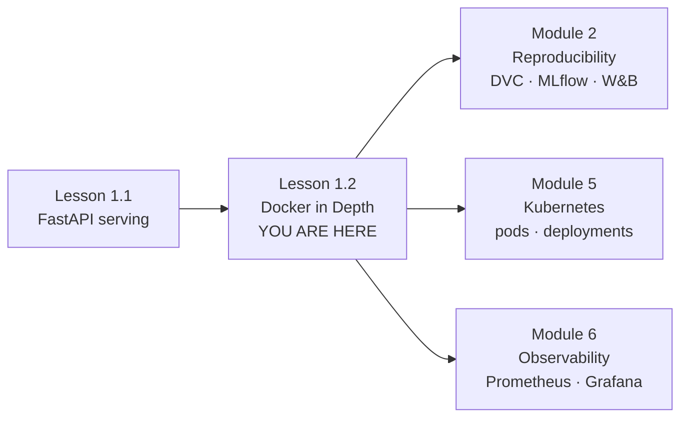

# Lesson 1.2 — Docker in Depth

> **Module 1 · The ML System** · [← Lesson 1.1: Serving with FastAPI](../Lesson_1_Serving_with_FastAPI/) · [Module 2: Reproducibility →](../../Module_2_Reproducibility/)

---

## The Problem

In Lesson 1.1, you wrapped a model in FastAPI. It worked on your laptop.

Now ship it to a server. It breaks.

Not because the code is wrong — because the **environment** is different. Python version, system libraries, environment variables. This is the oldest failure mode in software, and it kills ML deployments faster than bad models do.

Two tools solve this at two different scales:

| Scale | Tool | What it isolates |
|-------|------|------------------|
| One machine, one project | **Virtual environment** (`uv`) | Python packages |
| Any machine, any project | **Container** (Docker) | The entire userspace |

**Docker is the virtual environment generalized to the whole system.** This lesson walks that ladder from the bottom.

---

## The Mental Model

**Isolation is a spectrum.** Everything in this lesson is the same idea at different altitudes:

```
Python packages  →  Userspace  →  Whole OS
   (venv)           (container)     (VM)
```

You already trust venvs. By the end of this lesson, containers will feel like the same trick — one level up.

```
Dockerfile  →  Image  →  Container
(recipe)       (artifact)  (process)
```

Definition → artifact → running instance. This shape repeats through the entire course: DVC, MLflow, Feast, Kubernetes.

---

## The Ladder

Read in order. Each rung assumes only what came before.

| Step | Guide | What you learn |
|------|-------|----------------|
| 01 | [Why Virtual Environments Exist](01-virtual-env.md) | The dependency problem, from first principles |
| 02 | [Enter `uv`](02-uv.md) | The modern tool that makes venvs fast and reproducible |
| 03 | [Build the Training Pipeline](03-training-pipeline.md) | Python training job, running in a venv |
| 04 | [Why Containers Exist](04-why-container.md) | The same problem, one level up |
| 05 | [Dockerize the Training Job](05-dockerize-training.md) | Same script, now inside an image |
| 06 | [Serving — A Second Image](06-serving.md) | Node.js API, its own image, its own language |
| 07 | [Wiring Containers by Hand](07-network.md) | Networks, DNS, volumes — no Compose yet |
| 08 | [Docker Compose](08-compose.md) | The whole system, declared in one file |

**After step 08:** return here for the [Quick Start](#quick-start) and [Where It Fits](#where-it-fits).

---

## Quick Start

*(Run this after completing the ladder — it's the destination, not the starting point.)*

```bash
# From Lesson_2_Docker_in_Depth/

# 0. Create the output directory (bind mounts need the host path to exist)
mkdir -p training/output

# 1. Train the model (one-off, uses the "train" profile)
docker compose --profile train run --rm training

# 2. Bring up serving + redis
docker compose up --build

# 3. First call — runs the classifier, caches the result
curl -X POST http://localhost:3000/predict \
  -H "Content-Type: application/json" \
  -d '{"sepal_length":5.1,"sepal_width":3.5,"petal_length":1.4,"petal_width":0.2}'

# 4. Second call — same input, returns from cache
curl -X POST http://localhost:3000/predict \
  -H "Content-Type: application/json" \
  -d '{"sepal_length":5.1,"sepal_width":3.5,"petal_length":1.4,"petal_width":0.2}'

# 5. Check hit rate
curl http://localhost:3000/stats

# 6. Tear down
docker compose down
```

Verify the artifact was produced, owned by you:

```bash
ls -la training/output/
# -rw-r--r-- 1 silva silva 2113 ... model.joblib
```

---

## Where It Fits

Docker is **infrastructure** in the system map. Every other component — the serving API, the training job, the pipeline — runs inside a container.



- **Backward:** Lesson 1.1's FastAPI app is what we containerize here.
- **Forward (Module 2):** DVC versions the `model.joblib` your training container produces.
- **Forward (Module 5):** Kubernetes is Docker at scale — pods are containers, deployments are Compose with more knobs.
- **Forward (Module 6):** Observability instruments the container you build here.

> 📍 **Full system diagram:** [`SYSTEM_MAP.md`](../../SYSTEM_MAP.md)

---

## The Language-Agnostic Point

The demo uses **two languages on purpose** — Python for training, Node.js for serving.

Docker wraps any language the same way. The Dockerfile pattern, Compose structure, and networking concepts here apply identically to Python, Go, Java, or Rust services. **Docker doesn't care what runs inside.**

If you've only seen Docker used with Python, this lesson exists to break that association. The container is the unit of deployment. The language is an implementation detail.

---

## Files

| Path | Purpose |
|------|---------|
| `01-virtual-env.md` … `08-compose.md` | The ladder — read in order |
| [`training/`](training/) | Python training job (uv-managed, containerized) |
| [`training/output/`](training/output/) | Where the container writes `model.joblib` |
| [`serving/`](serving/) | Node.js prediction API (containerized) |
| [`docker-compose.yml`](docker-compose.yml) | Wires training + serving + redis |
| [`docker_commands.md`](docker_commands.md) | Reference: containers vs VMs, Dockerfile internals |

---

## Key Terms

| Term | Definition |
|------|------------|
| **Virtual environment** | Isolated Python `site-packages`. Shares interpreter and OS with host. |
| **uv** | Fast Python package and project manager. Replaces pip, venv, pip-tools. |
| **Image** | Read-only template with app + dependencies. Built from a Dockerfile. |
| **Container** | Running instance of an image. A process with isolated filesystem/network. |
| **Layer** | Cached filesystem diff produced by a Dockerfile instruction. |
| **Namespace** | Linux kernel feature giving a process its own view of pid/net/mnt/uts. |
| **cgroup** | Linux kernel feature capping CPU/memory for a process group. |
| **Bind mount** | Host directory mapped into a container. Two-way. Ownership-sensitive. |
| **Named volume** | Docker-managed storage that outlives a container. |
| **Bridge network** | User-defined Docker network. Provides DNS between containers. |
| **Port mapping** | `host:container` — exposes a container port on the host. |
| **Compose** | Declarative multi-container definition in YAML. |
| **Profile** | Compose feature — a service that only starts when explicitly requested. |