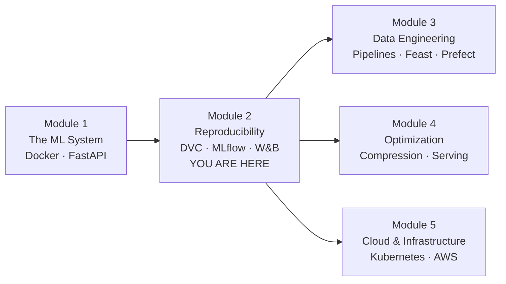

# Module 2 — Reproducibility

*You can't improve what you can't reproduce.*

> **Module 1 · [← The ML System](../Module_1_ML_Systems_Intro/)** · [Module 3: Data Engineering →](../Module_3_Data_Engineering/)

---

## The Problem

You ship a model. It works. Three months later it starts to drift. You want to retrain it.

You open your laptop:

- **The training script** — which version? You have 40 commits.
- **The training data** — which file? `data.csv`? `data-v2.csv`? `data-final.csv`?
- **The hyperparameters** — which ones? You wrote them on a sticky note. You lost the sticky note.
- **The environment** — which packages? Your `pyproject.toml` has 30 dependencies and no lockfile.

You cannot reproduce the model.

This is the failure mode that eats ML teams alive. It shows up as five different problems:

- **Debugging** — the model's performance dropped. Was it a code change? A new library version? A different seed? Without reproducibility, you're chasing a moving target.
- **Collaboration** — a teammate wants to verify your 91% result. Without reproducibility, they're guessing what environment you ran in.
- **Compliance** — a regulator asks how the credit-risk model was trained. Without reproducibility, you can't answer.
- **Continuity** — the engineer who built the model leaves. Without reproducibility, the knowledge leaves with them.
- **Production** — you retrain every month. The new model is worse than the old one. Without reproducibility, you can't tell why.

Because **reproducibility is not a property of the model.**

It's a property of the chain that produced it.

```
data → code → environment → run → artifact → model
```

Break any link, and the whole chain breaks. You can't trace where it broke. You can't fix it.

Module 1 fixed the **environment** link — Docker.

Module 2 fixes the other three.

---

## The Mental Model

**Reproducibility is a chain.**

Every link has the same three-part shape you saw in Module 1:

```
definition  →  artifact         →  instance
Dockerfile  →  image            →  container
pyproject   →  uv.lock          →  .venv
```

You'll see the same shape again, once per lesson:

```
data        →  code      →  environment  →  run        →  artifact       →  model
[d→a→i]        [d→a→i]      [d→a→i]         [d→a→i]      [d→a→i]           [d→a→i]
```

| Link | Definition | Artifact | Instance |
|------|-----------|----------|----------|
| **Data** | `.dvc` file | hash + remote pointer | checked-out dataset |
| **Run** | training script | run ID + metrics + artifacts | re-run from same inputs |
| **Team** | run config | shared dashboard + lineage | teammate reproduces your work |

Same shape, three levels.  
**Learn it once, use it everywhere.**

---

## The Four Challenges

Reproducibility is hard in ML in a way it isn't in traditional software. Four reasons:

| # | Challenge | Why it breaks reproducibility | Fixed by |
|---|-----------|------------------------------|----------|
| 1 | **Randomness** | Same code, same data — different model. Seeds, shuffles, weight init. | Seed fixation (in code, every demo) |
| 2 | **Data size** | Can't commit GBs to git. Can't diff binary files. Can't share them via pull request. | **Lesson 2.1 — DVC** |
| 3 | **Environment** | Library versions, system libs, CUDA drivers, OS-level differences. | **Module 1 — Docker** |
| 4 | **Ad-hoc experimentation** | Experiments tracked in notebooks, comments, memory. No structured record. | **Lessons 2.2 & 2.3 — MLflow, W&B** |

Module 1 fixed #3. Module 2 fixes #2 and #4.

Challenge #1 — randomness — is handled in the demo code itself. Every training script in this module sets seeds for Python, NumPy, and the framework. That's a practice, not a tool.

---

## The Three Lessons

Each lesson fixes one link in the chain. This isn't a menu of tools — it's a **diagnostic**.

When you can't reproduce a model, the failure is always in one of three places.

| # | Failure | Question you can't answer | Symptom you notice | Lesson |
|---|---------|--------------------------|-------------------|--------|
| 1 | **Data** | "Which data trained the model?" | You have multiple CSVs and no record of which trained which model | [2.1 DVC](Lesson_1_Data_and_Model_Versioning/) |
| 2 | **Run** | "Which of my 20 experiments was best?" | You remember a 97% run but can't find its hyperparameters | [2.2 MLflow](Lesson_2_Experiment_Tracking_MLflow/) |
| 3 | **Team** | "How do I know what my teammate ran?" | You can't see their experiments. You can't trace a model back to its data. | [2.3 W&B](Lesson_3_Experiment_Tracking_WandB/) |

They compound. Fixing data alone leaves runs untraceable. Fixing runs alone leaves the team blind.

But they also **diagnose**. When something breaks, look at the chain and find the broken link. The symptom tells you which lesson to reach for.

---

## The Lessons

| # | Lesson | Guide | Length |
|---|--------|-------|--------|
| 2.1 | [Data & Model Versioning — DVC](Lesson_1_Data_and_Model_Versioning/) | [`README.md`](Lesson_1_Data_and_Model_Versioning/README.md) | 5 rungs |
| 2.2 | [Experiment Tracking — MLflow](Lesson_2_Experiment_Tracking_MLflow/) | [`README.md`](Lesson_2_Experiment_Tracking_MLflow/README.md) | 4 rungs |
| 2.3 | [Experiment Tracking — W&B](Lesson_3_Experiment_Tracking_WandB/) | [`README.md`](Lesson_3_Experiment_Tracking_WandB/README.md) | 5 rungs |

Read them in order. Each assumes only the previous one.

---

## Where This Fits

Reproducibility sits between the Serving Layer (Module 1) and Data Engineering (Module 3).

Without it, you can't debug a model, retrain it safely, or monitor it in production — because you can't reconstruct the exact code, data, and parameters that produced the artifact you're looking at.



- **Backward:** Module 1 gave you the container. This module gives you the ability to reproduce what runs inside it.
- **Forward (Module 3):** Data pipelines produce versioned artifacts. DVC is what versions them.
- **Forward (Module 4):** Optimized models are also artifacts. Same pattern.
- **Forward (Module 5):** Kubernetes pulls versioned artifacts from a registry. The registry is built on the discipline you learn here.

> 📍 **Full system diagram:** [`SYSTEM_MAP.md`](../SYSTEM_MAP.md)

---

## The Chain, Visualized

```
        data         code       environment       run          artifact       model
         │            │             │             │              │             │
     ┌───┴───┐    ┌───┴───┐    ┌────┴─────┐   ┌───┴───┐    ┌─────┴─────┐  ┌────┴────┐
     │ 2.1   │    │ git   │    │ Module 1 │   │ 2.2   │    │ 2.2       │  │ 2.3     │
     │ DVC   │    │       │    │ Docker   │   │MLflow │    │ MLflow    │  │ W&B     │
     └───────┘    └───────┘    └──────────┘   └───────┘    └───────────┘  └─────────┘

Each link fixed by exactly one tool.
Break any link → the chain breaks → the model is unreproducible.
```

The full board is [`reproducibility-chain.excalidraw`](reproducibility-chain.excalidraw).

---

## The Five-Step Progression

Where DVC sits — from "files on disk" to "serving-ready features":

```
1. Files on disk               no versioning, overwritten, lost
2. Git for data                repo bloat, not practical beyond small files
3. DVC for data                versioned data tied to git commits       ← Lesson 2.1
4. DVC + experiment tracking   link data versions to model metrics      ← Lessons 2.2, 2.3
5. Feature store               versioned, serving-ready features        ← Module 3
```

Each rung adds one thing. Each rung assumes the previous.

---

## Files

| Path | Purpose |
|------|---------|
| [`Lesson_1_Data_and_Model_Versioning/`](Lesson_1_Data_and_Model_Versioning/) | DVC — versions the data link |
| [`Lesson_2_Experiment_Tracking_MLflow/`](Lesson_2_Experiment_Tracking_MLflow/) | MLflow — versions the run link |
| [`Lesson_3_Experiment_Tracking_WandB/`](Lesson_3_Experiment_Tracking_WandB/) | W&B — versions the team link |
| [`reproducibility-chain.excalidraw`](reproducibility-chain.excalidraw) | The module board |

---

## Key Terms

| Term | Definition |
|------|------------|
| **Reproducibility** | The ability to reconstruct the exact artifacts from the same inputs |
| **The chain** | `data → code → environment → run → artifact → model` — the pipeline that produces a model |
| **Determinism** | Same inputs → same outputs. Achieved via seed fixation in code |
| **Content addressing** | Storing files by their hash, not their name. Git and DVC both do this |
| **DVC** | Data Version Control — versions large data alongside git |
| **`.dvc` file** | A small pointer: "this data is at this hash on this remote" |
| **DVC remote** | Storage backend (S3, GCS, SSH, local) |
| **`dvc.yaml`** | Declarative pipeline: stages, dependencies, outputs |
| **`dvc repro`** | Rerun only the pipeline stages whose dependencies changed |
| **MLflow** | Self-hosted experiment tracking + model registry |
| **Experiment (MLflow)** | A named collection of runs |
| **Run** | One training execution: params, metrics, artifacts, tags |
| **Tracking server** | The backend that stores runs |
| **Model registry** | Versioned catalog with stages (staging → production) |
| **W&B** | Cloud-native experiment tracking + artifact lineage |
| **Project (W&B)** | Same concept as an MLflow experiment — a named collection of runs |
| **Artifact (W&B)** | A versioned, cloud-backed file or folder |
| **Artifact lineage** | The chain: raw data → processed data → model → deployment |
| **Alias (W&B)** | Mutable pointer to a version — `best`, `staging`, `production` |
| **Imperative pipeline** | W&B builds the DAG from execution, not from a config file |

---

## Checkpoint

You should now be able to answer:

- **What's the chain?** `data → code → environment → run → artifact → model`.
- **What did Module 1 fix vs Module 2?** Module 1 fixed the environment link. Module 2 fixes data, run, and team.
- **Why three lessons?** Each fixes a different link. They compound.
- **What's the recurring shape?** definition → versioned artifact → reproducible instance. Same triune as Module 1.
- **When something breaks, how do you know which lesson to reach for?** Look at the symptom. The failure table maps symptoms to lessons.
- **What about randomness?** It's challenge #1, handled in code (seed fixation), not by a tool.

**Start here:** [Lesson 2.1 — DVC →](Lesson_1_Data_and_Model_Versioning/)

---

## How to Use This Module

**For a first read:** follow the lessons in order. Each one is a ladder — read the guide top to bottom, don't skip to the commands.

**For a diagnostic:** when a model fails to reproduce, look at the symptom table. The failure mode tells you which lesson to reach for.

**For a reference:** the Key Terms table above and each lesson's Quick Reference section are the two places to bookmark.

---

> *"If it isn't reproducible, it isn't science.*
> *In MLOps, that means it doesn't ship."*