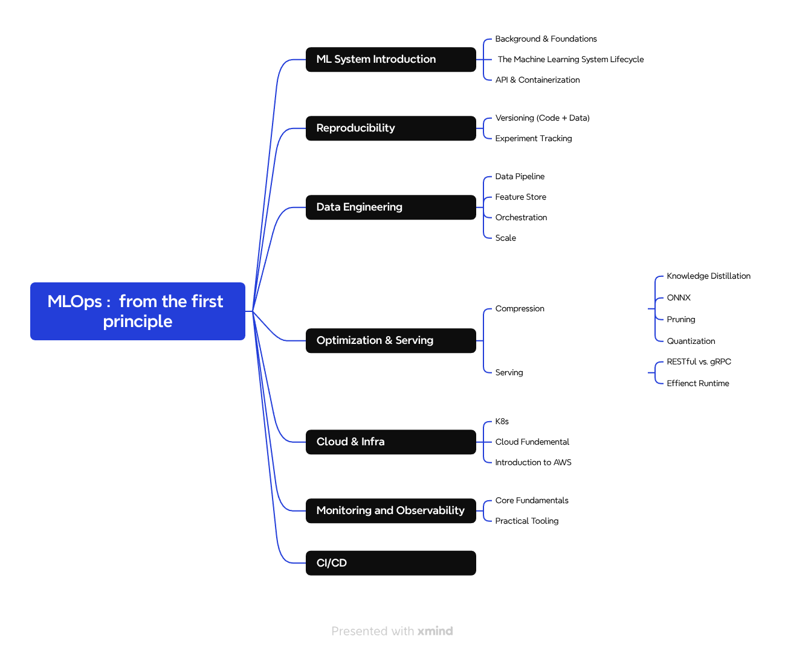
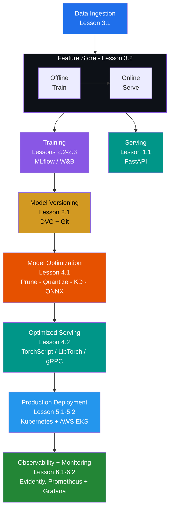
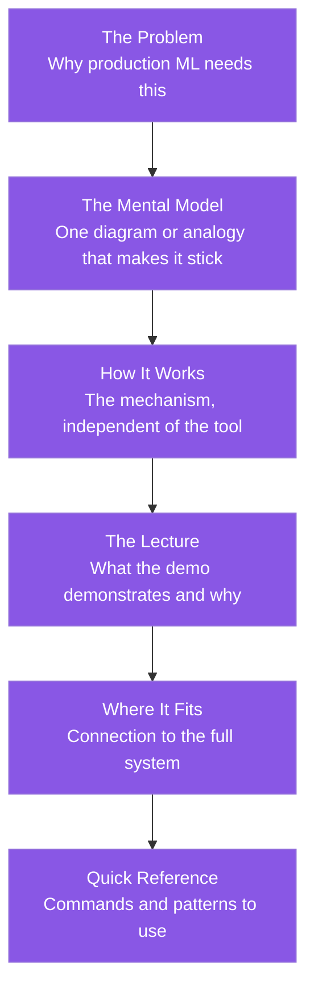
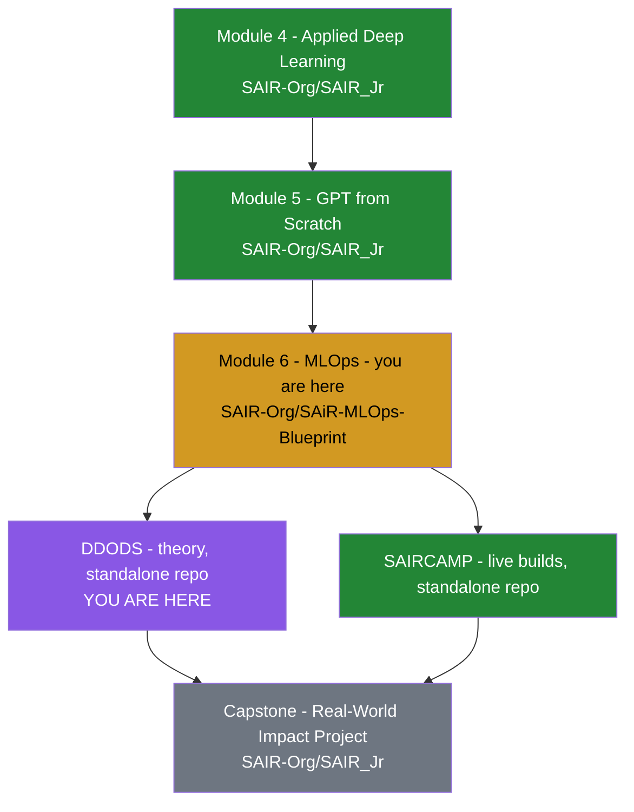

# MLOps from First Principles


<p align="center">
  
</p>

> *"The goal is not to teach you tools. It is to give you a mental model of the production ML system."*

A companion resource for the video lecture series.
Open this repo alongside the lectures — not instead of them.

---

## 📚 Table of Contents

- [🔗 Part of SAiR MLOps Blueprint](#-part-of-sair-mlops-blueprint)
- [📖 What This Repo Is](#-what-this-repo-is)
- [🏗️ The System We Are Building](#️-the-system-we-are-building)
- [🗺️ The Course Arc](#️-the-course-arc)
- [🧭 How to Use This Repo](#-how-to-use-this-repo)
- [📦 Course Map](#-course-map)
- [📐 Module Structure](#-module-structure)
- [⚙️ Prerequisites](#️-prerequisites)
- [🚀 Quick Navigation](#-quick-navigation)
- [🛠️ Technologies by Module](#️-technologies-by-module)
- [🏷️ Status Legend](#️-status-legend)
- [🎥 Companion Resource](#-companion-resource)
- [📚 Where This Fits in SAIR Jr.](#-where-this-fits-in-sair-jr)
- [📄 License](#-license)

---

## 🔗 **Part of SAiR MLOps Blueprint**

This repo is the **theory track** of the SAiR MLOps module.

| Resource | Link |
|---|---|
| **Hub Repo** | [SAIR-Org/SAiR-MLOps-Blueprint](https://github.com/SAIR-Org/SAiR-MLOps-Blueprint) |
| **Implementation Track** | [SAIR-Org/SAiRCAMP_1](https://github.com/SAIR-Org/SAiRCAMP_1) |
| **YouTube Theory Playlist** | [MLOps from First Principles](https://youtube.com/playlist?list=PLVM9Nqm8zLE0&si=jtIah3TJB8PjOMgu) |

**Use this repo for:** Understanding the concepts, mental models, and theory behind MLOps.
**Use SAIRCAMP for:** Building the end-to-end production system.

> 📌 **Take both tracks together** — watch the theory, then build it live.

---

## 📖 What This Repo Is

The lectures demonstrate. This repo explains.

Each module guide is structured as a lecture companion — the concepts, diagrams, and references you need while watching. The code is secondary: it is what the demo runs, not what the lecture is about.

**The goal is not to teach you tools. It is to give you a mental model of the production ML system and show how each tool solves a specific failure mode in that system.**

---

## 🏗️ The System We Are Building



> 📍 **Full system diagram:** See [`SYSTEM_MAP.md`](SYSTEM_MAP.md)

---

## 🗺️ The Course Arc

Most ML courses teach tools in isolation: "here is MLflow, here is Docker." This course takes a different path: **start at the end, then fill in the gaps.**

```mermaid
flowchart TD
    subgraph Mod1["MODULE 1 - The ML System"]
        L11["1.1 - You have a model.<br/>How does anything call it?<br/>↳ FastAPI wraps it. Docker runs it anywhere."]
        L12["1.2 - Docker underlies everything else.<br/>How does it actually work?<br/>↳ Containers, images, layers, Compose."]
    end

    subgraph Mod2["MODULE 2 - Reproducibility"]
        L21["2.1 - Which version is in production?<br/>↳ DVC: versions data + models with git."]
        L22["2.2 - You ran 20 experiments.<br/>Which was best?<br/>↳ MLflow: structured logs, comparison."]
        L23["2.3 - Your team can't see<br/>each other's experiments.<br/>↳ W&B: cloud-native tracking, lineage."]
    end

    subgraph Mod3["MODULE 3 - Data Engineering for ML"]
        L31["3.1 - What is in that data,<br/>and how is it built?<br/>↳ ETL/ELT, validation, feature engineering."]
        L32["3.2 - Training and serving compute<br/>features differently.<br/>↳ Feast: one definition for both."]
        L33["3.3 - How does it run<br/>every day, at scale?<br/>↳ Prefect orchestrates. Spark distributes."]
    end

    subgraph Mod4["MODULE 4 - Model Optimization & Serving"]
        L41["4.1 - The model is too<br/>large or too slow.<br/>↳ Prune - Quantize - KD - ONNX."]
        L42["4.2 - Coupled to Python.<br/>Can't reach C++.<br/>↳ TorchScript, LibTorch, gRPC."]
    end

    subgraph Mod5["MODULE 5 - Cloud and Infrastructure"]
        L51["5.1 - A single container<br/>is not production.<br/>↳ Kubernetes: pods, deployments, services."]
        L52["5.2 - Production requires<br/>cloud infrastructure.<br/>↳ AWS: EC2, S3, ECR, VPC, IAM, EKS."]
    end

    subgraph Mod6["MODULE 6 - Observability and Monitoring"]
        L60["Foundations - Understand why models<br/>degrade and how to detect it."]
        L61["6.1 - Data drift goes undetected<br/>without monitoring.<br/>↳ Evidently: statistical drift detection."]
        L62["6.2 - Production metrics need<br/>a scalable stack.<br/>↳ Prometheus + Grafana: time-series, dashboards."]
    end

    Mod1 --> Mod2 --> Mod3 --> Mod4 --> Mod5 --> Mod6

    classDef m fill:#238636,color:#fff
    class Mod1,Mod2,Mod3,Mod4,Mod5,Mod6 m
```



---

## 🧭 How to Use This Repo

| **When** | **What to do** |
|----------|----------------|
| **During the lecture** | Open the module guide and follow along. The guide provides the conceptual anchor for what the lecture is demonstrating. |
| **After the lecture** | Return to the deep-dive sections. The content goes further than the video to give you the full picture. |
| **For reference** | `SYSTEM_MAP.md` shows where every piece fits. Reconnects isolated concepts to the whole system. |
| **For progressive lessons** | Some lessons (e.g., 1.2 Docker) are structured as a **ladder** — a series of small guides read in order. Start at the lesson `README.md`, not at the code. |

---

## 📦 Course Map

<details open>
<summary><strong>Module 1 — The ML System</strong> · <em>Start at the end. Understand what you're building toward.</em></summary>

| Lesson | Topic | Guide | Status |
|--------|-------|-------|--------|
| 1.1 | [Serving with FastAPI](Module_1_ML_Systems_Intro/Lesson_1_Serving_with_FastAPI/) | [FASTAPI_DOCKER_GUIDE.md](Module_1_ML_Systems_Intro/Lesson_1_Serving_with_FastAPI/FASTAPI_DOCKER_GUIDE.md) | ✓ |
| 1.2 | [Docker in Depth](Module_1_ML_Systems_Intro/Lesson_2_Docker_in_Depth/) | [README.md](Module_1_ML_Systems_Intro/Lesson_2_Docker_in_Depth/README.md) — start here, then walk the ladder (01 → 08) | ✓ |

</details>

<details open>
<summary><strong>Module 2 — Reproducibility</strong> · <em>You can't improve what you can't reproduce.</em></summary>

| Lesson | Topic | Guide | Status |
|--------|-------|-------|--------|
| 2.1 | [Data & Model Versioning — DVC](Module_2_Reproducibility/Lesson_1_Data_and_Model_Versioning/) | [DVC_GUIDE.md](Module_2_Reproducibility/Lesson_1_Data_and_Model_Versioning/DVC_GUIDE.md) | ✓ |
| 2.2 | [Experiment Tracking — MLflow](Module_2_Reproducibility/Lesson_2_Experiment_Tracking_MLflow/) | [README.md](Module_2_Reproducibility/Lesson_2_Experiment_Tracking_MLflow/README.md) | ✓ |
| 2.3 | [Experiment Tracking — W&B](Module_2_Reproducibility/Lesson_3_Experiment_Tracking_WandB/) | [WANDB_GUIDE.md](Module_2_Reproducibility/Lesson_3_Experiment_Tracking_WandB/WANDB_GUIDE.md) | ✓ |

</details>

<details open>
<summary><strong>Module 3 — Data Engineering for ML</strong> · <em>The model is only as good as the data that reaches it.</em></summary>

| Lesson | Topic | Guide | Status |
|--------|-------|-------|--------|
| 3.1 | [Data Pipelines](Module_3_Data_Engineering/Lesson_1_Data_Pipelines/) | [DATA_PIPELINE_GUIDE.md](Module_3_Data_Engineering/Lesson_1_Data_Pipelines/DATA_PIPELINE_GUIDE.md) | ✓ |
| 3.2 | [Feature Store — Feast](Module_3_Data_Engineering/Lesson_2_Feature_Store/) | [FEAST_GUIDE.md](Module_3_Data_Engineering/Lesson_2_Feature_Store/FEAST_GUIDE.md) | ✓ |
| 3.3 | [Orchestration + Scale](Module_3_Data_Engineering/Lesson_3_Orchestration_and_Scale/) | [DATA_PIPELINE_PART3_GUIDE.md](Module_3_Data_Engineering/Lesson_3_Orchestration_and_Scale/DATA_PIPELINE_PART3_GUIDE.md) | ✓ |

</details>

<details open>
<summary><strong>Module 4 — Model Optimization & Serving</strong> · <em>The model that trains is rarely the model that deploys.</em></summary>

| Lesson | Topic | Guide | Status |
|--------|-------|-------|--------|
| 4.1 | [Compression](Module_4_Model_Optimization_and_Serving/Lesson_1_Compression/) | [Overview](Module_4_Model_Optimization_and_Serving/Lesson_1_Compression/COMPRESSION_OVERVIEW.md) · [Pruning](Module_4_Model_Optimization_and_Serving/Lesson_1_Compression/pruning/PRUNING_GUIDE.md) · [Quantization](Module_4_Model_Optimization_and_Serving/Lesson_1_Compression/Quantization/QNT_GUIDE.md) · [KD](Module_4_Model_Optimization_and_Serving/Lesson_1_Compression/KD/KD_GUIDE.md) · [ONNX](Module_4_Model_Optimization_and_Serving/Lesson_1_Compression/onnx/ONNX_GUIDE.md) | ✓ |
| 4.2 | [Serving](Module_4_Model_Optimization_and_Serving/Lesson_2_Serving/) | [TorchScript](Module_4_Model_Optimization_and_Serving/Lesson_2_Serving/TorchScript/TORCHSCRIPT_GUIDE.md) · [LibTorch](Module_4_Model_Optimization_and_Serving/Lesson_2_Serving/LibTorch/LIBTORCH_GUIDE.md) · [gRPC](Module_4_Model_Optimization_and_Serving/Lesson_2_Serving/API_gRPC/GRPC_GUIDE.md) | ✓ |

</details>

<details open>
<summary><strong>Module 5 — Cloud and Infrastructure</strong> · <em>A deployed model is a system. Systems require infrastructure.</em></summary>

| Lesson | Topic | Guide | Status |
|--------|-------|-------|--------|
| 5.1 | [Kubernetes](Module_5_Cloud_and_Infra/Lesson_1_K8s/) | [K8s.md](Module_5_Cloud_and_Infra/Lesson_1_K8s/K8s.md) · [README.md](Module_5_Cloud_and_Infra/Lesson_1_K8s/README.md) | ✓ |
| 5.2 | [Cloud & AWS](Module_5_Cloud_and_Infra/Lesson_2_Cloud_and_AWS/) | [Cloud Fundamentals](Module_5_Cloud_and_Infra/Lesson_2_Cloud_and_AWS/1-Cloud_Fundemetals.html) · [AWS Intro](Module_5_Cloud_and_Infra/Lesson_2_Cloud_and_AWS/2-aws-intro.html) · [EKS](Module_5_Cloud_and_Infra/Lesson_2_Cloud_and_AWS/3-EKS.html) | ✓ |

</details>

<details open>
<summary><strong>Module 6 — Observability and Monitoring</strong> · <em>A model in production is a living system — it needs vital signs.</em></summary>

| Lesson | Topic | Guide | Status |
|--------|-------|-------|--------|
| Foundations | [Core Concepts](Module_6_Observability_and_Monitoring/FOUNDATIONS.md) | Taxonomy of failures, drift detection, logging principles | ✓ |
| 6.1 | [Evidently](Module_6_Observability_and_Monitoring/Evidently/) | [README.md](Module_6_Observability_and_Monitoring/Evidently/README.md) · [evidently-demo.ipynb](Module_6_Observability_and_Monitoring/Evidently/evidently-demo.ipynb) | ✓ |
| 6.2 | [Prometheus & Grafana](Module_6_Observability_and_Monitoring/prometheus_and_Grafana/) | [README.md](Module_6_Observability_and_Monitoring/prometheus_and_Grafana/README.md) · [app.py](Module_6_Observability_and_Monitoring/prometheus_and_Grafana/app.py) · [dashboard.json](Module_6_Observability_and_Monitoring/prometheus_and_Grafana/dashboard.json) | ✓ |

</details>

---

## 📐 Module Structure

Each module guide follows the same pattern:



> 💡 **Read the problem and mental model first.** The code is obvious after that.

---

## ⚙️ Prerequisites

<details>
<summary><strong>Click to expand full prerequisites list</strong></summary>

```bash
# Core
Python 3.10+
uv (pip install uv)
Docker Desktop
Git

# Module 2
W&B account (free at wandb.ai)

# Module 5
kubectl
kind or minikube
awscli (for AWS deployment)

# Module 6
Prometheus (for metrics collection)
Grafana (for visualization)
```

</details>

---

## 🚀 Quick Navigation

| Area | Path |
|------|------|
| 📊 System Overview | [`SYSTEM_MAP.md`](SYSTEM_MAP.md) |
| 🚀 Module 1 — Serving | [`Module_1_ML_Systems_Intro/`](Module_1_ML_Systems_Intro/) |
| 📈 Module 2 — Reproducibility | [`Module_2_Reproducibility/`](Module_2_Reproducibility/) |
| 🗄️ Module 3 — Data Engineering | [`Module_3_Data_Engineering/`](Module_3_Data_Engineering/) |
| ⚡ Module 4 — Optimization | [`Module_4_Model_Optimization_and_Serving/`](Module_4_Model_Optimization_and_Serving/) |
| ☁️ Module 5 — Cloud & Infrastructure | [`Module_5_Cloud_and_Infra/`](Module_5_Cloud_and_Infra/) |
| 📡 Module 6 — Observability | [`Module_6_Observability_and_Monitoring/`](Module_6_Observability_and_Monitoring/) |

---

## 🛠️ Technologies by Module

| Module | Technologies |
|--------|--------------|
| 1 | FastAPI, uv, Docker, Docker Compose |
| 2 | Git, DVC, MLflow, Weights & Biases |
| 3 | Feast, Prefect, Spark, Pandas |
| 4 | Pruning, Quantization, KD, ONNX, TorchScript, LibTorch, gRPC |
| 5 | Kubernetes, AWS (EC2, S3, ECR, VPC, IAM, EKS) |
| 6 | Evidently, Prometheus, Grafana |

---

## 🏷️ Status Legend

| Icon | Meaning |
|------|---------|
| ✓ | Complete |
| 🚧 | In Progress |
| 📝 | Planned |

---

## 🎥 Companion Resource

This repo is the written half of the course. The video lecture series is the visual, live demonstration half. Neither is complete without the other.

> **When the video moves fast:** slow down here.
> **When a guide feels abstract:** watch the demo.

---

## 📚 **Where This Fits in SAIR Jr.**



---

## 📄 License

This project is for educational purposes. All content is provided as a companion resource to the video lecture series.
